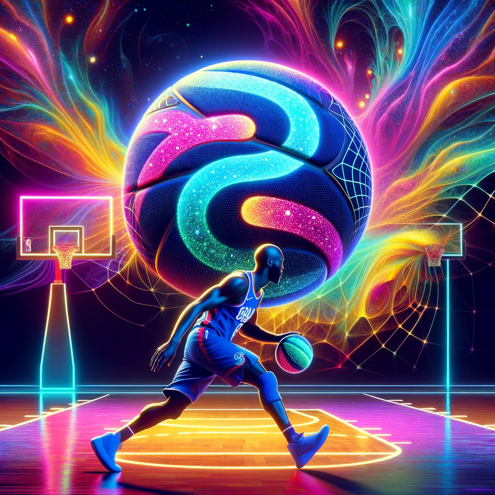
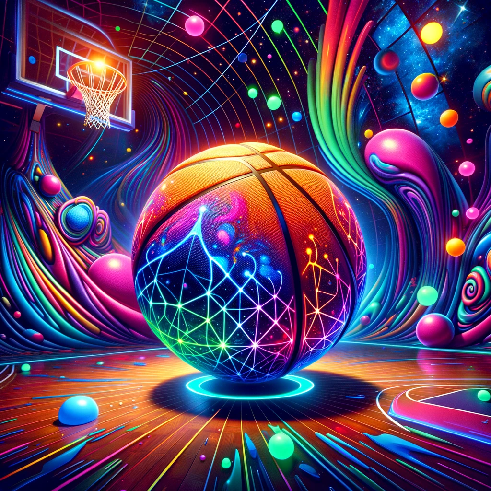

# NBA_GraphQL

GraphQL Endpoint for my NBA DB

## How to use this endpoint

- Navigate to [http://209.38.172.107/graphql/](http://209.38.172.107/graphql/) to view the GraphiQL interface.
- Use the graphical interactive in-browser GraphQL IDE to query and test your code.

- Player Totals Example:
-

```graphQL
query MyQuery {
  playerTotalsAll(name: "LeBron James") {
    playerName
    position
    season
    team
    games
    id
  }
}
```

You may query endpoints with 6 different filters and 3 ordering functions. The filters are for player name, season, team, position, unique 'playerID', and by database id (pk).

The id is consistent across the per game, totals, and advanced data.

You can return 32 different fields of data as described in the following query:

```graphQL
query MyQuery2 {
  playerTotalsAll(position: "C", ordering: "-total_rb") {
    age
    assists
    blocks
    defensiveRb
    effectFgPercent
    fieldAttempts
    fieldGoals
    ft
    fieldPercent
    ftAttempts
    ftPercent
    games
    gamesStarted
    id
    minutesPg
    offensiveRb
    personalFouls
    playerId
    playerName
    points
    position
    season
    steals
    team
    threeAttempts
    threeFg
    threePercent
    totalRb
    turnovers
    twoAttempts
    twoFg
    twoPercent
  }
}
```

Player Advanced Example:

```graphQL
query MyQuery3 {
  playerAdvancedAll(
    team: "HOU"
    season: 2019
    position: "PG"
    ordering: "-win_shares"
  ) {
    playerName
    position
    team
    season
    winShares
  }
}
```

This will query the PlayerAdvanced database for the Houston Rockets, then for season 2019, then select only the PGs, and order them by win shares in descending order.

You can return 29 fields from the advanced model as described in the following query:

```graphQL
query MyQuery4 {
  playerAdvancedAll(name: "Kobe Bryant") {
    id
    age
    assistPercent
    blockPercent
    box
    defensiveBox
    defensiveRbPercent
    defensiveWs
    ftr
    games
    minutesPlayed
    offensiveBox
    offensiveRbPercent
    offensiveWs
    per
    playerId
    playerName
    position
    stealPercent
    season
    team
    threePAr
    totalRbPercent
    tsPercent
    turnoverPercent
    usagePercent
    vorp
    winShares
    winSharesPer
  }
}
```

## Here's a trippy take on the GraphQL and NBA blend: a player, amidst a swirl of colors, dribbles a ball that's a universe in itself, echoing the patterns of GraphQL in a cosmic court. 🌀🏀🌌



## In this cosmic fusion, the GraphQL logo intertwines with the NBA's spirit, creating a surreal basketball extravaganza. Imagine this ball spinning in an otherworldly court, where the game transcends reality. 🌌🏀✨



## More images :D

"Clip art to represent the NBA GraphQL data point and database that I will be assembling"


## Enter Virtual Environment

```bash
source venv/bin/activate
```
